<h1 align="center">
  🎄 Advent of Code 🎄
</h1>

> [Advent of Code](https://adventofcode.com/)
>
> <cite> Advent of Code is an Advent calendar of small programming puzzles for a variety of skill sets and skill levels that can be solved in any programming language you like. People use them as interview prep, company training, university coursework, practice problems, a speed contest, or to challenge each other.</cite>

> Tiles generation: [https://github.com/LiquidFun/adventofcode]([github.com/LiquidFun/](https://github.com/LiquidFun/adventofcode))

<!-- AOC TILES BEGIN -->
<h1 align="center">
  2022 - 50 ⭐
</h1>
<a href="2022/01/01.jl">
  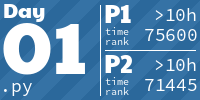
</a>
<a href="2022/02/02.py">
  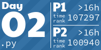
</a>
<a href="2022/03/03.py">
  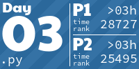
</a>
<a href="2022/04/04.cpp">
  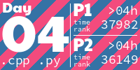
</a>

<a href="2022/06/06.py">
  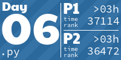
</a>
<a href="2022/07/07.py">
  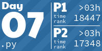
</a>

<a href="2022/09/09.py">
  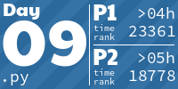
</a>

<a href="2022/11/11.py">
  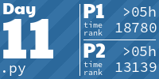
</a>
<a href="2022/12/12.py">
  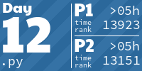
</a>
<a href="2022/13/13.py">
  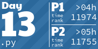
</a>
<a href="2022/14/14.py">
  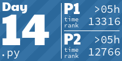
</a>
<a href="2022/15/15.py">
  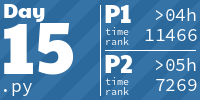
</a>
<a href="2022/16/16.py">
  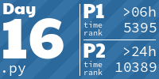
</a>
<a href="2022/17/17.py">
  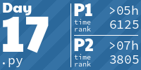
</a>
<a href="2022/18/18.py">
  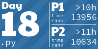
</a>
<a href="2022/19/19.py">
  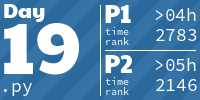
</a>
<a href="2022/20/20.py">
  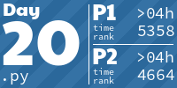
</a>
<a href="2022/21/21.py">
  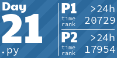
</a>
<a href="2022/22/22.py">
  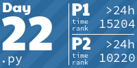
</a>
<a href="2022/23/23.py">
  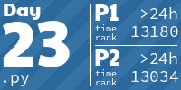
</a>
<a href="2022/24/24.py">
  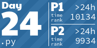
</a>
<a href="2022/25/25.py">
  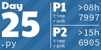
</a>
<h1 align="center">
  2021 - 32 ⭐
</h1>

<a href="2021/02/2.py">
  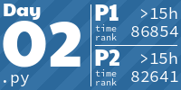
</a>

<a href="2021/04/4.py">
  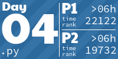
</a>

<a href="2021/06/6.py">
  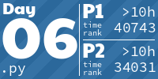
</a>
<a href="2021/07/7.cpp">
  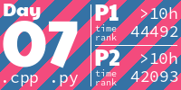
</a>
<a href="2021/08/8.py">
  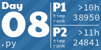
</a>
<a href="2021/09/9.py">
  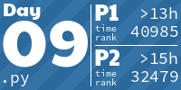
</a>
<a href="2021/10/10.py">
  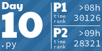
</a>
<a href="2021/11/11.py">
  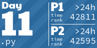
</a>
<a href="2021/12/12.py">
  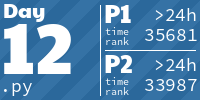
</a>
<a href="2021/13/13.py">
  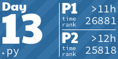
</a>
<a href="2021/14/14.py">
  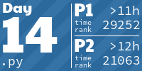
</a>
<a href="2021/15/15.py">
  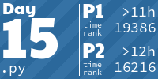
</a>

<a href="2021/17/17.py">
  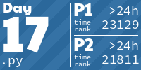
</a>
<h1 align="center">
  2020 - 27 ⭐
</h1>
<a href="2020/01/1.py">
  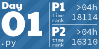
</a>
<a href="2020/02/2.py">
  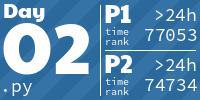
</a>

<a href="2020/04/4.py">
  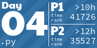
</a>
<a href="2020/05/5.py">
  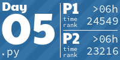
</a>
<a href="2020/06/6.py">
  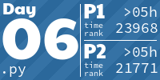
</a>
<a href="2020/07/7.py">
  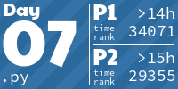
</a>
<a href="2020/08/8.py">
  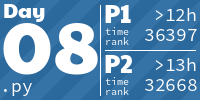
</a>
<a href="2020/09/9.py">
  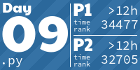
</a>
<a href="2020/10/10.py">
  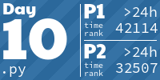
</a>
<a href="2020/11/11.py">
  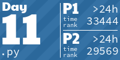
</a>
<a href="2020/12/12.py">
  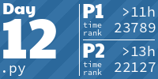
</a>
<a href="None">
  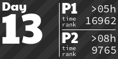
</a>

<h1 align="center">
  2019 - 19 ⭐
</h1>

<a href="2019/02/part1.jl">
  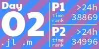
</a>

<a href="2019/08/part1.m">
  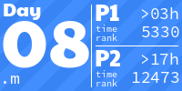
</a>

<h1 align="center">
  2015 - 4 ⭐
</h1>

<a href="2015/02/2.py">
  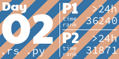
</a>
<!-- AOC TILES END -->
